# Diagrama de Secuencia Global — FactoryFlow ERP

A continuación se muestra el ciclo de vida completo de un flujo operativo dentro de **FactoryFlow ERP**, desde la autenticación hasta la venta final, empleando la sintaxis Mermaid.js para su renderización.

```mermaid
sequenceDiagram
    actor A as Administrador
    actor O as Operario Bodega
    actor J as Jefe Producción
    actor V as Vendedor
    participant FE as Frontend (HTML/JS SPA)
    participant BE as Backend (FastAPI)
    participant DB as Base de Datos (SQLite/PostgreSQL)

    %% === Flujo 0: Autenticación ===
    rect rgb(30, 30, 60)
    Note over A, DB: Fase de Autenticación
    A->>FE: Ingresa credenciales (admin / admin123)
    FE->>BE: POST /auth/login (username, password)
    BE->>DB: Consulta users WHERE username = ?
    BE->>BE: Verifica bcrypt hash
    BE->>BE: Genera JWT (access_token + refresh_token)
    DB->>DB: Almacena refresh_token
    BE-->>FE: {access_token, refresh_token, token_type}
    FE-->>A: Dashboard cargado con KPIs
    end

    %% === Flujo 1: Registro de Proveedor ===
    rect rgb(20, 50, 40)
    Note over O, DB: Fase de Abastecimiento
    O->>FE: Registra Proveedor (nombre, email, teléfono)
    FE->>BE: POST /materials/suppliers
    BE->>DB: INSERT INTO suppliers
    BE-->>FE: Proveedor registrado (UUID)
    end

    %% === Flujo 2: Entrada de Materia Prima ===
    rect rgb(20, 50, 40)
    O->>FE: Ingreso de Materia Prima (Material, Cantidad, Costo, Proveedor)
    FE->>BE: POST /inventory/movement {type: "IN", material_id, quantity_primary, unit_cost, supplier_id}
    BE->>DB: Consulta RawMaterial (stock, cpp, conversion_factor)
    BE->>BE: Recalcula CPP = (stock×cpp + qty×cost) / total
    BE->>BE: Actualiza stock_primary y stock_secondary
    BE->>DB: INSERT INTO inventory_movements + UPDATE raw_materials
    BE-->>FE: Movimiento confirmado, nuevo CPP calculado
    FE-->>O: Tabla de inventario actualizada
    end

    %% === Flujo 3: Creación de Producto con BOM ===
    rect rgb(40, 30, 50)
    Note over J, DB: Fase de Ingeniería de Producto
    J->>FE: Define Producto (nombre, precio, BOM, procesos)
    FE->>BE: POST /products/ {name, sale_price, bom_items[], processes[]}
    BE->>DB: Valida que materiales del BOM existan
    BE->>DB: INSERT INTO products + bom_items + product_processes
    BE-->>FE: Producto registrado con receta y procesos
    FE-->>J: Catálogo actualizado
    end

    %% === Flujo 4: Orden de Producción ===
    rect rgb(50, 40, 20)
    Note over J, DB: Fase de Producción (Transacción ACID)
    J->>FE: Crear Orden (Producto, Cantidad)
    FE->>BE: POST /production-orders/ {product_id, quantity, step_assignments[]}
    BE->>DB: Consulta BOM del producto
    BE->>BE: Calcula materiales: BOM.qty × cantidad_orden
    BE->>BE: Valida stock suficiente para cada materia prima
    BE->>DB: UPDATE raw_materials (stock_primary -= requerido)
    BE->>DB: INSERT INTO inventory_movements (type=OUT por cada material)
    BE->>DB: INSERT INTO production_consumptions (trazabilidad)
    BE->>DB: INSERT INTO production_steps (asignación de operarios)
    BE->>DB: UPDATE products (current_stock += cantidad producida)
    BE->>DB: UPDATE production_orders (status = completed)
    Note over BE, DB: COMMIT atómico — todo o nada
    BE-->>FE: Orden completada, inventario actualizado
    FE-->>J: Cola de manufactura y stock actualizados
    end

    %% === Flujo 5: Venta Final ===
    rect rgb(50, 20, 30)
    Note over V, DB: Fase Comercial (Transacción ACID)
    V->>FE: Registra Cliente (nombre, email)
    FE->>BE: POST /sales/clients {name, email}
    BE->>DB: INSERT INTO clients
    BE-->>FE: Cliente UUID asignado

    V->>FE: Crear Venta (Cliente, Producto, Cantidad)
    FE->>BE: POST /sales/ {client_id, items: [{product_id, quantity, unit_price}]}
    BE->>DB: Valida stock de producto terminado
    BE->>DB: UPDATE products (current_stock -= cantidad vendida)
    BE->>DB: INSERT INTO sales + sale_items
    BE->>BE: Calcula total = Σ(quantity × unit_price)
    Note over BE, DB: COMMIT atómico — todo o nada
    BE-->>FE: Venta registrada, factura generada
    FE-->>V: Historial de ventas actualizado, KPIs recalculados
    end
```

