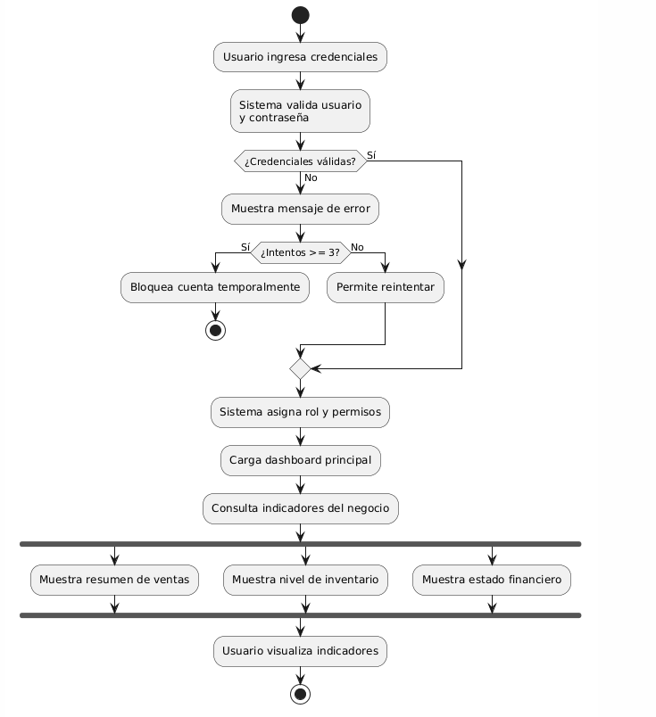
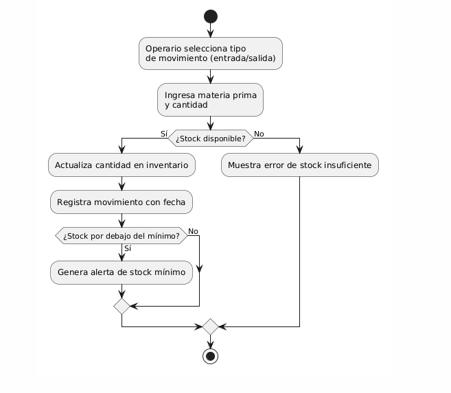
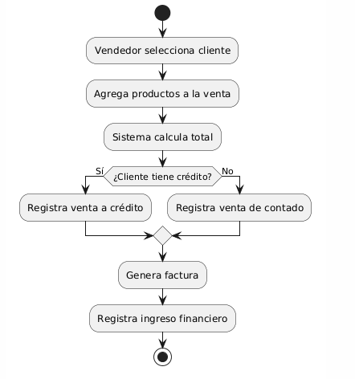

# Elicitación de Requisitos

## FactoryFlow ERP — Sistema de Trazabilidad Total para Manufactura Industrial

**Autores:** Equipo de Desarrollo FactoryFlow  
**Fecha:** Mayo 2026  
**Versión:** 2.0

---

## Resumen

El presente documento detalla la fase de elicitación de requerimientos para el sistema **FactoryFlow ERP**. Este sistema está diseñado para integrar y controlar todos los subprocesos de una empresa manufacturera, abarcando proveedores, inventario de materias primas con doble unidad de medida, producción basada en listas de materiales (BOM) con trazabilidad y asignación de personal, y la venta final a clientes con deducción atómica de inventario. La documentación se presenta bajo los lineamientos de las normas APA (7.ª edición) adaptados a Markdown (American Psychological Association [APA], 2020).

---

## 1. Identificación de Actores del Sistema (Stakeholders)

Se han identificado los siguientes actores principales que interactúan con el sistema:

| Actor | Rol en el Sistema | Módulos que Utiliza |
|-------|-------------------|---------------------|
| **Administrador del Sistema** | Acceso global a configuración, dashboards y gestión de usuarios | Dashboard, todos los módulos |
| **Jefe de Producción** | Formula recetas BOM, crea y supervisa órdenes de producción | Productos, Producción |
| **Operario de Bodega / Producción** | Registra entradas/salidas de inventario, reporta avances en producción | Inventario, Producción |
| **Vendedor / Asesor Comercial** | Registra clientes, crea ventas vinculadas a productos terminados | Ventas y Clientes |

---

## 2. Requerimientos Funcionales Elicitados

Durante las entrevistas con los stakeholders, se definieron los siguientes requerimientos que el sistema implementa:

1. **Gestión de Proveedores y Compras**: El sistema mantiene un directorio de proveedores (`POST /materials/suppliers`). Cada movimiento de entrada de materia prima puede enlazarse a su proveedor correspondiente mediante el campo `supplier_id` en los movimientos de inventario.

2. **Control de Inventario con Doble Unidad de Medida**: Materias primas como "Harina de Trigo" se ingresan en unidad primaria (ej. kilogramos) y se calculan automáticamente a unidad secundaria (ej. gramos) usando un factor de conversión configurable. El sistema recalcula automáticamente el **Costo Promedio Ponderado (CPP)** en cada entrada.

3. **Flujo de Producción con Trazabilidad BOM**: El sistema permite crear recetas (Lista de Materiales) asociadas a productos. Al crear una orden de producción, el sistema deduce automáticamente las materias primas del inventario según las cantidades definidas en el BOM, registra los consumos para trazabilidad, y permite asignar operarios a cada paso del proceso.

4. **Sistema de Ventas y Clientes**: Toda venta de producto terminado reduce el inventario del producto, genera un registro de facturación con total calculado, y se vincula al cliente comprador — todo dentro de una transacción ACID.

5. **Dashboard Trazable**: El sistema provee indicadores inmediatos (KPIs) sobre: cantidad de materias primas, cantidad de productos, órdenes pendientes, ingresos totales, y alertas de desabastecimiento (stock < 10 unidades).

---

## 3. Diagramas de Casos de Uso

*Figura 1.* Caso de uso del operario de bodega gestionando el inventario de materias primas.

*Figura 2.* Caso de uso del jefe de producción y operario gestionando BOM y órdenes de producción.

*Figura 3.* Caso de uso del vendedor gestionando ventas y contabilidad.

---

## 4. Diagramas de Actividad

Los diagramas de actividad detallan el flujo paso a paso de las rutinas clave del sistema.

*Figura 4.* Flujo de actividad: Ingreso de credenciales para autenticación en el sistema.

*Figura 5.* Flujo de actividad: Operario selecciona tipo de movimiento de inventario (entrada/salida).

*Figura 6.* Flujo de actividad: Vendedor selecciona cliente para registrar una venta.

---

## Referencias

American Psychological Association. (2020). *Publication manual of the American Psychological Association* (7.ª ed.).

IEEE. (1998). *IEEE Recommended Practice for Software Requirements Specifications* (IEEE Std 830-1998). Institute of Electrical and Electronics Engineers.

Sommerville, I. (2015). *Ingeniería de Software* (10.ª ed.). Pearson Educación.
