# Especificación de Requisitos de Software (SRS)

## FactoryFlow ERP — Sistema de Trazabilidad Total para Manufactura Industrial

**Autores:** Equipo de Desarrollo FactoryFlow  
**Fecha:** Mayo 2026  
**Versión:** 2.0

---

## 1. Introducción

### 1.1 Propósito

El propósito de este documento es establecer los requisitos funcionales y no funcionales para el sistema **FactoryFlow ERP**. Esta especificación servirá como guía principal para el diseño, desarrollo y pruebas del sistema, garantizando la trazabilidad total del inventario, los procesos de producción y las ventas (IEEE, 1998).
https://unab.edu.co/subete-al-bus-unab/
### 1.2 Alcance

FactoryFlow ERP es un sistema integral diseñado para automatizar y controlar la cadena de valor en empresas manufactureras. Sus módulos principales son:

1. **Gestión de Proveedores**: Directorio de proveedores vinculados a entradas de materiales.
2. **Control de Inventario**: Registro de materias primas con sistema de **doble unidad de medida** (ej. kg → g) y cálculo automático de **Costo Promedio Ponderado (CPP)**.
3. **Producción**: Creación de productos terminados con recetas (BOM — Bill of Materials), ejecución de órdenes de producción con deducción atómica de inventario y asignación de personal a procesos.
4. **Ventas y Clientes**: Gestión de clientes, creación de ventas con deducción de stock de producto terminado y generación de registros de facturación.
5. **Dashboard**: Visualización en tiempo real de KPIs operativos (stock, órdenes pendientes, ingresos, alertas).

### 1.3 Arquitectura Técnica

El sistema consta de dos capas:

- **Backend**: API REST desarrollada en **FastAPI** (Python), con base de datos relacional **SQLite** para desarrollo y **PostgreSQL** para producción, utilizando **SQLAlchemy 2.0** como ORM.
- **Frontend**: Aplicación SPA (Single Page Application) construida en **HTML/JavaScript puro** con diseño glassmorfismo oscuro, que consume los endpoints del backend mediante llamadas `fetch`.

---

## 2. Requerimientos Funcionales

### RF-01 — Módulo de Proveedores y Materiales

El sistema debe permitir el registro de proveedores con nombre, email y teléfono. Cada entrada de materia prima al inventario puede opcionalmente vincularse a su proveedor de origen.

- **Endpoint**: `GET/POST /materials/suppliers`
- **Modelo de datos**: `Supplier(id, name, contact_email, phone, created_at)`

### RF-02 — Módulo de Inventario (Doble Unidad de Medida y CPP)

El sistema debe controlar el inventario de materias primas con dos unidades de medida simultáneas (primaria y secundaria), enlazadas por un factor de conversión configurable. Al registrar un movimiento de entrada (IN), se recalcula automáticamente el **Costo Promedio Ponderado** mediante la fórmula:

```
CPP = (stock_actual × cpp_actual + cantidad_nueva × costo_nuevo) / stock_total
```

- **Endpoint**: `POST /inventory/movement`
- **Modelo de datos**: `InventoryMovement(id, material_id, type[IN/OUT], quantity_primary, quantity_secondary, unit_cost, supplier_id)`

### RF-03 — Módulo de Productos y BOM

El sistema permite registrar productos terminados con su precio de venta, **lista de materiales (BOM)** requeridos para su fabricación, y los **procesos de fabricación** con su orden secuencial.

- **Endpoints**: `GET/POST /products/`
- **Modelo de datos**: `Product(id, name, sale_price, current_stock)`, `BOMItem(product_id, material_id, quantity_required)`, `ProductProcess(product_id, name, order_index)`

### RF-04 — Módulo de Producción (Trazabilidad con BOM)

Al crear una orden de producción, el sistema:

1. Valida que el producto tenga BOM definida.
2. Calcula los materiales requeridos: `BOM.quantity_required × cantidad_a_producir`.
3. Valida stock suficiente de cada materia prima.
4. Deduce automáticamente el inventario (movimientos OUT) en ambas unidades.
5. Registra consumos trazables (`ProductionConsumption`).
6. Crea pasos de producción (`ProductionStep`) con posibilidad de asignación a operarios.
7. Incrementa el stock del producto terminado.
8. Todo dentro de una **transacción ACID única**.

- **Endpoints**: `GET/POST /production-orders/`

### RF-05 — Módulo de Ventas y Clientes

El sistema permite registrar clientes y crear ventas con múltiples líneas de productos. Al confirmar una venta:

1. Valida stock disponible de cada producto.
2. Deduce el stock del producto terminado.
3. Calcula el total de la factura.
4. Todo dentro de una **transacción ACID única**.

- **Endpoints**: `GET/POST /sales/`, `GET/POST /sales/clients`

### RF-06 — Dashboard de Control

El dashboard muestra en tiempo real:
- Cantidad total de materias primas registradas.
- Cantidad total de productos registrados.
- Órdenes de producción pendientes.
- Ingresos totales acumulados por ventas.
- Alertas de stock bajo (materiales con stock < 10 unidades).

---

## 3. Requerimientos No Funcionales

1. **Eficiencia**: La API soporta respuestas asíncronas con tiempos de respuesta < 500ms.
2. **Seguridad**: Autenticación mediante JWT (Bearer Token), contraseñas cifradas con bcrypt.
3. **Integridad de datos**: Todas las operaciones críticas (producción, ventas) se ejecutan en transacciones ACID con rollback automático ante errores.
4. **Escalabilidad**: Arquitectura modular con patrón Repository que permite migrar de SQLite a PostgreSQL sin cambios en la lógica de negocio.

---

## 4. Diseño del Sistema

### 4.1 Diagramas de Clases

*Figura 1.* Diagrama de clases del módulo de ventas: Cliente, Venta, Factura y Registro de Producto.

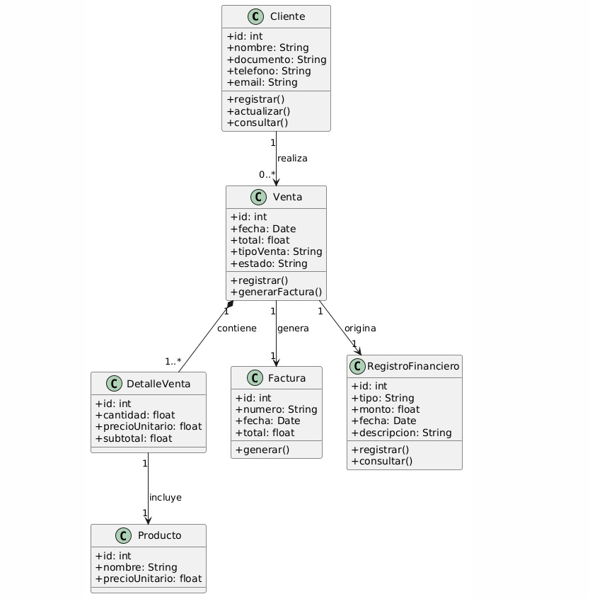

*Figura 2.* Diagrama de clases del módulo de inventario: Materia Prima, Movimiento y Alertas de Stock.

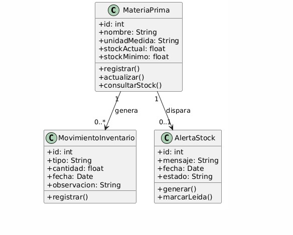

*Figura 3.* Diagrama de clases del módulo de producción: Orden de Producción, Pasos y Consumos.

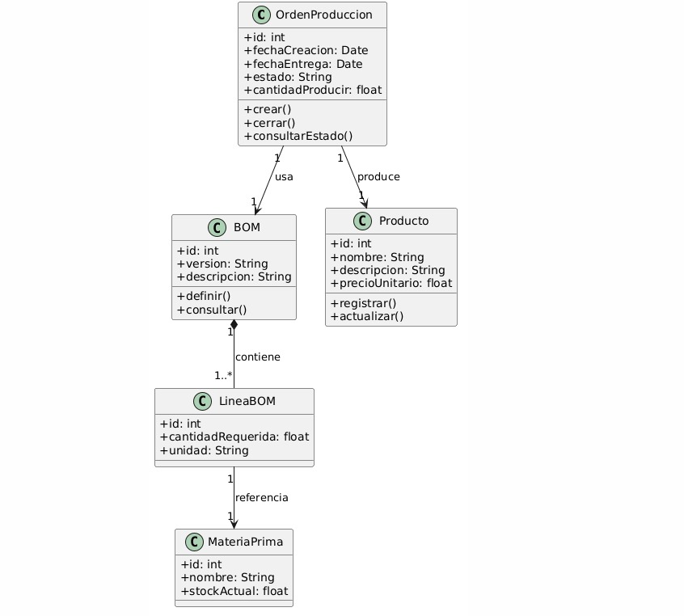

### 4.2 Diagramas de Componentes

*Figura 4.* Arquitectura de componentes: Frontend SPA, Backend FastAPI y Persistencia SQLAlchemy.

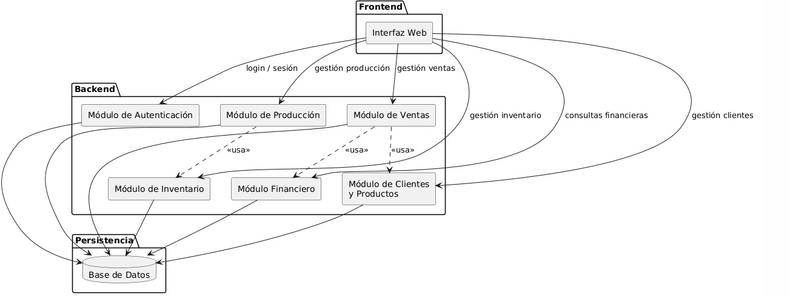

*Figura 5.* Componentes del módulo de producción: Producción, Inventario y Base de Datos.

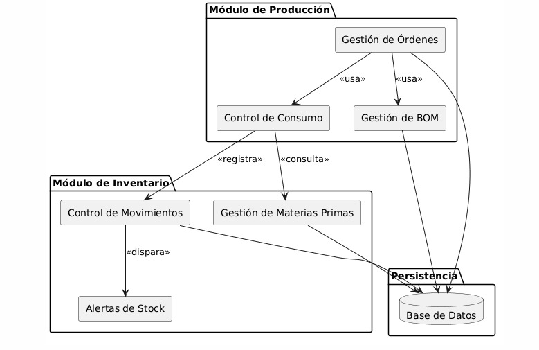

*Figura 6.* Componentes del módulo de ventas: Ventas, Clientes, Módulo Financiero y Persistencia.

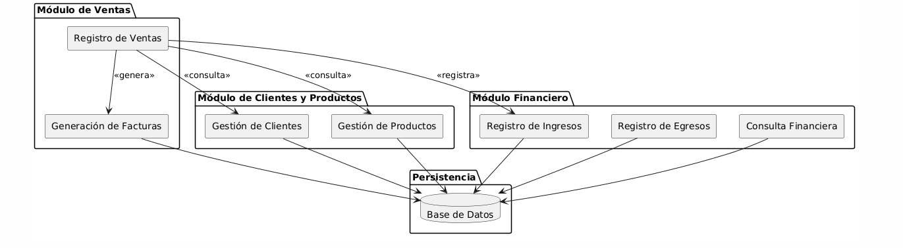

### 4.3 Diagramas de Despliegue

*Figura 7.* Diagrama de capas lógicas: Presentación (HTML/JS), Negocio (FastAPI), Datos (SQLAlchemy/SQLite).

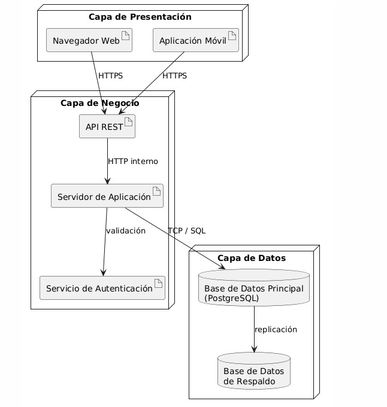

*Figura 8.* Despliegue en infraestructura de red: Cliente, Balanceador, Servidores y Base de Datos.

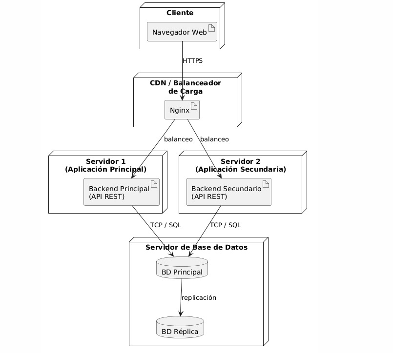

*Figura 9.* Despliegue de dispositivos: Dispositivo de usuario, Servidor de Aplicación y Servidor de Base de Datos.


### 4.4 Diagramas de Estados

*Figura 10.* Diagrama de estados del registro inicial del usuario en el sistema.

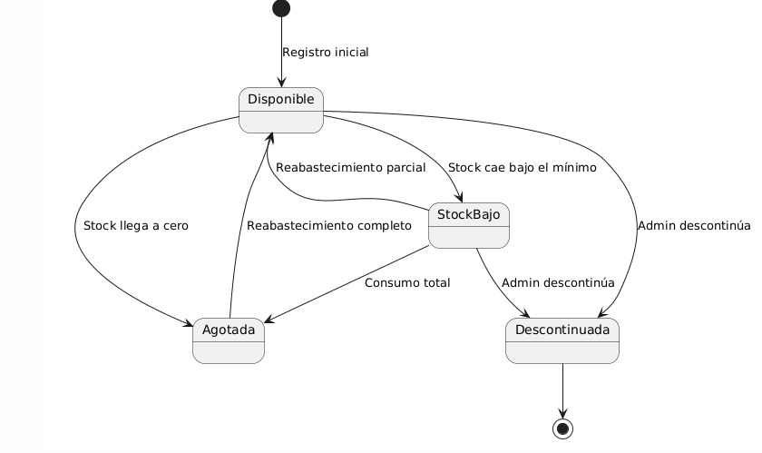

*Figura 11.* Diagrama de estados del proceso de venta por el vendedor.

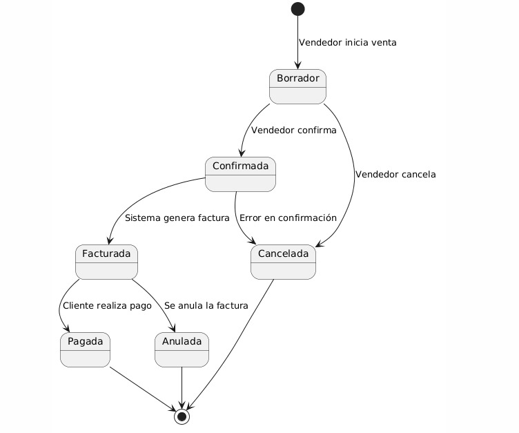

*Figura 12.* Diagrama de estados para la creación de órdenes de producción por el jefe de producción.

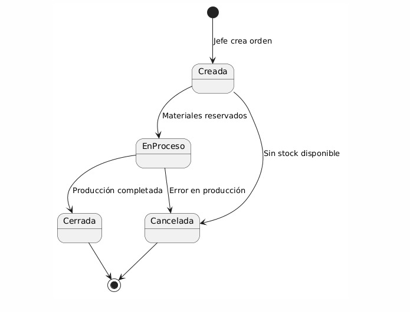

---

## Referencias

IEEE. (1998). *IEEE Recommended Practice for Software Requirements Specifications* (IEEE Std 830-1998). Institute of Electrical and Electronics Engineers.

Sommerville, I. (2015). *Ingeniería de Software* (10.ª ed.). Pearson Educación.
